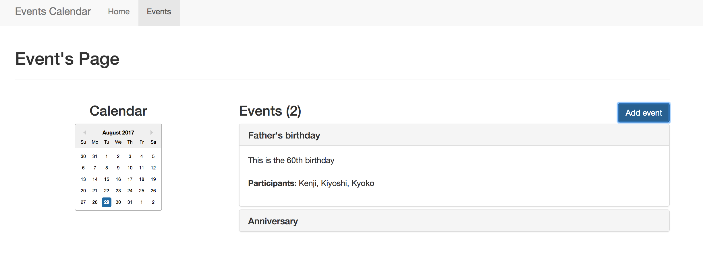

# react-you-owe-me

This is a side project build with React + Redux + Redux-Thunk + React Router + Bootstrap.



## Build and Run

To build and run this application you will need installed NodeJS(npm) in your machine.

Run this command to install all dependencies:
```sh
npm install
```

Run this command to build and deploy the application:

```sh
npm start
```


## URL
http://localhost:3000
